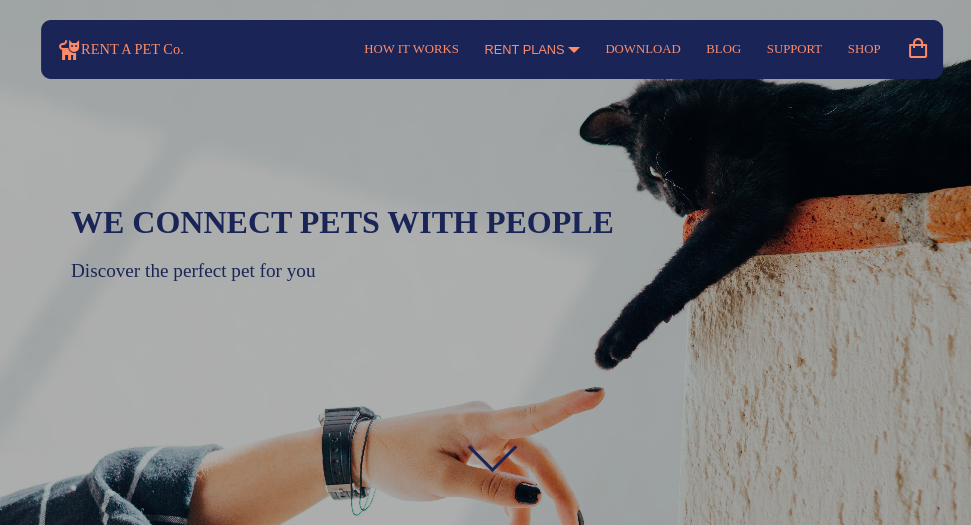

# Fake E-shop

## Description 
This project represents front-end part for E-shop of fake company "Rent a pet Co."

## Features
- Mobile first design
- Fully responsive
- Image transition on hover
- Drop downs
- Modals
- Etc...

## Try it out: 
https://tykejmi.github.io/E-shop/

## Technologies used:
- HTML5
- CSS3
- JS

## Credits
- This project was made as challange from frontendpractice.com. The task was to replicate functionality of monogramcc.com/shop/ but with changed design.
- All images are from pexels.com (hence some of them are little thematicly weird)
- All icons are from boxicons.com

